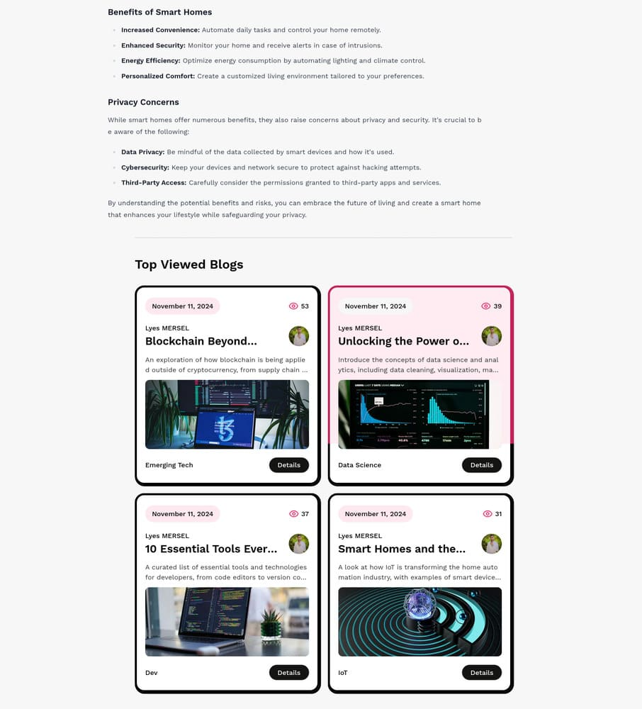

<div align="center">
  <a href="https://github.com/lyes-mersel/intech-blogs">
    
  </a><br />
</div>

# inTech Blogs

**inTech Blogs** is a modern blogging platform where tech enthusiasts can share insights and engage with the community on topics like AI, cybersecurity, software development, and more. Built with the latest features of Next.js 15 and React 19, inTech Blogs is optimized for a seamless user experience.

---

## Table of Contents
- [Features](#features)
- [Getting Started](#getting-started)
  - [Prerequisites](#prerequisites)
  - [Installation](#installation)
- [Usage](#usage)
- [Screenshots](#screenshots)
- [Contributing](#contributing)
- [License](#license)
- [Developer Information](#developer-information)

---

## Features

- **Latest Next.js 15 Architecture**: Leveraging Next.js’s App Folder Structure, client and server components, dynamic routes, and advanced API routes.
- **Versatile Data Fetching**: Optimized data fetching with SSR, SSG, ISR, and PPR for efficient performance.
- **SEO & Metadata**: Integrated Next.js 15 SEO capabilities for better reach.
- **GitHub Authentication**: Secure GitHub sign-in with NextAuth for quick access.
- **CMS Powered by Sanity**: Dynamic content management with Sanity CMS.
- **Error Tracking**: Comprehensive error handling with Sentry.
- **Tailwind CSS Styling**: Responsive, modern design.
- **TypeScript**: Enhances code reliability and maintainability.

---

## Getting Started

### Prerequisites

- **Git**: Version control
- **Node.js**: Runtime environment
- **Environment Variables**: Listed below

### Installation

1. **Clone the Repository**

    ```bash
    git clone https://github.com/lyes-mersel/intech-blogs.git
    cd intech-blogs
    ```

2. **Install Dependencies**

    ```bash
    npm install
    ```

3. **Set Up Environment Variables**

    In the root directory, create a `.env.local` file and add:

    ```plaintext
    # Authentication
    AUTH_SECRET=your_auth_secret
    AUTH_GITHUB_ID=your_github_oauth_app_id
    AUTH_GITHUB_SECRET=your_github_oauth_app_secret

    # Sanity CMS
    NEXT_PUBLIC_SANITY_PROJECT_ID=your_sanity_project_id
    NEXT_PUBLIC_SANITY_DATASET=your_sanity_dataset
    NEXT_PUBLIC_SANITY_API_VERSION="vX"
    SANITY_WRITE_TOKEN=your_sanity_write_token

    # Sentry
    SENTRY_AUTH_TOKEN=your_sentry_auth_token
    ```

4. **Run the Development Server**

    ```bash
    npm run dev
    ```

    Open [http://localhost:3000](http://localhost:3000) to view in the browser.

---

## Usage

- **Explore Content**: Discover topics in AI, Cybersecurity, Software Engineering, and more.
- **Create Blogs**: Sign in with GitHub to publish and share your insights with the tech community.

---

## Screenshots

| 1 | 2 | 3 | 3 |  4 | 
| -------| ------- | -------| ------- | -------|
|  |  |  |  |  |

---

## Contributing

We welcome contributions! Here’s how to contribute:

1. **Fork the Project**
2. **Create a New Branch** (`git checkout -b feature/YourFeature`)
3. **Commit Your Changes** (`git commit -m 'Add Your Feature'`)
4. **Push to the Branch** (`git push origin feature/YourFeature`)
5. **Open a Pull Request**

---

## License

This project is licensed under the MIT License. See `LICENSE` for more information.

---

## Developer Information

- **Portfolio** - [My Portfolio Link](https://lyes-mersel.netlify.app)
- **GitHub** - [@lyes-mersel](https://github.com/lyes-mersel)
- **LinkedIn** - [@lyes-mersel](https://www.linkedin.com/in/lyes-mersel)

---

**inTech Blogs** connects tech minds worldwide—join us, share your insights, and be part of the conversation shaping the future of technology!
